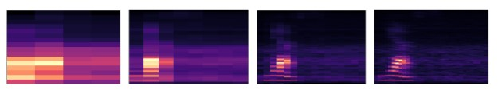
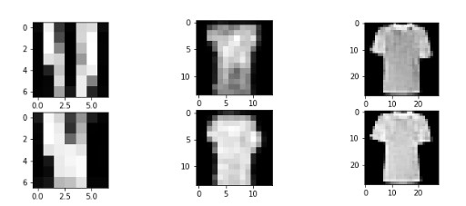
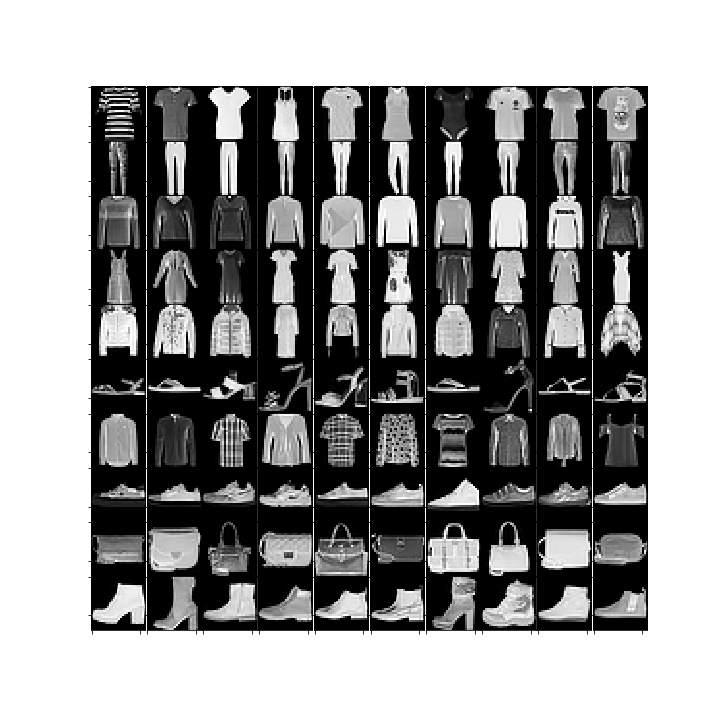
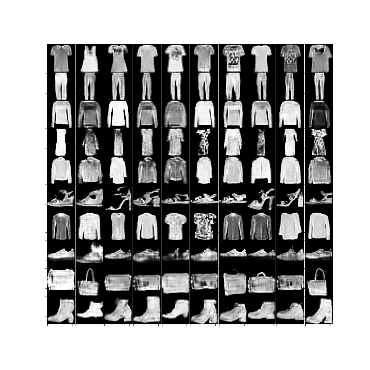

# GAN-Data-Augmentation

## Data
This experiment utilizes two main datasets.  The first is Google’s Speech Commands Dataset.  This dataset contains 30 different speech commands but for the purposes of this project, only the following speech commands were used: 'no', 'stop','yes', 'up', 'down', 'left', 'right'.  20% of the samples from each command were reserved for testing the accuracy of the trained CNN.  The other 80% was used for both the training of the GAN and CNN. 

The second dataset is the Fashion-MNIST data which consists of a training set of 60,000 samples and a test set of 10,000 samples.  Each sample is a 28x28 grayscale image, associated with a label from 10 classes.

## Working with Audio Clips
Because GANs are traditionally used to generate images, I decided to convert all of the raw audio clips into spectrograms.  Spectrograms are visual representations of the frequencies of signals as it varies with time.   I relied on the Librosa machine learning library in Python to transform the raw audio into mel-scaled spectrograms.  I used a sampling rate of 16000 and n_mels of 128.  The power of a spectrogram is the exponent for the magnitude mel spectrogram and was another parameter that I spent time tuning.  I found that a power of 0.5 gave a clear image, resulting in the best results in training.  The spectrograms were converted back to .wav files using Librosa’s mel_to_audio function, which inverts a mel spectrogram to audio using the Griffin-Lim algorithm.

## Progressive Growing GANs
GANs are known for being difficult to train due to its instability.  Some of the problems I faced while training a Deep Convolutional GAN (DCGAN) was that the  model parameters became unstable and never converged or the discriminator became so good at distinguishing real and fake samples that its gradient vanished and the generator was unable to learn anything meaningful.

To overcome these challenges, I utilized the architecture of a Progressive Growing GAN.  This GAN is based on the research paper published in 2017 titled “Progressive Growing of GANs for Improved Quality, Stability, and Variation”.  The researchers who contributed to that paper were able to generate extremely realistic high-definition 1024x1024 images of celebrities.  Their approach starts with training the GAN on smaller images and then incrementally increasing the size of the images until they reach the desired output resolution.  The training process involves period of fine-tuning the model and periods of slowly phasing in new layers, with larger resolutions.  The new layers are added in gradually to avoid sudden shocks to the already trained smaller-resolution layers.  This architecture works well because the model is able to focus on general shapes first, and then move on to the details.  In a typical GAN all the details have to be learned simultaneously which makes it more unstable.  My model for the audio data starts with a 16x4 image, then increases to 32x8, 64x16, and finally 128x32.  The architecture I used for the Fashion-MNIST dataset started with a 7x7 image, then increased to 14x14, and finally to 28x28.

Sample Progression of an Audio Spectrogram:
   
Sample progression of a Fashion-MNIST T-shirt:
   

## Samples
Real Samples from Fashion-MNIST:
  
Samples generated by the GAN:
  
